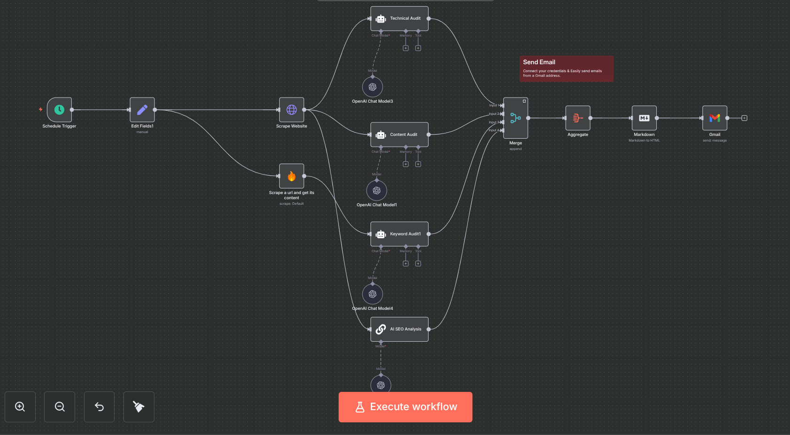

# Web 页面 SEO 审计自动化 - 基于 n8n 和 Firecrawl

## 概述

**SEO 自动化分析助手** 利用 **n8n** 和 **Firecrawl** 工具自动化执行全面的 Web 页面 SEO 审计。该工具分析页面的 **On-Page SEO 关键词审计**、**内容审计** 和 **技术审计**，并生成详细的报告，提供可操作的改进建议。

通过自动化 SEO 审计流程，网站管理员和 SEO 专业人士可以节省时间，专注于执行优化而不是进行手动检查。

---

## 功能

### 1. **On-Page SEO 关键词审计**
   - **关键词密度**：衡量关键词在页面中的出现频率。
   - **关键词相关性**：评估关键词与页面内容的相关性。
   - **关键词布局**：检查关键词在标题、头部标签（H1、H2 等）和元描述中的布局情况。
   - **SEO 分数**：根据关键词优化情况提供一个 SEO 分数。

### 2. **On-Page SEO 内容审计**
   - **内容可读性**：使用 Flesch-Kincaid 等指标评估内容的可读性。
   - **内容原创性**：检查内容是否有抄袭，确保内容的独特性。
   - **内容深度**：评估内容是否足够全面，能够回答用户的查询。
   - **内容结构**：检查页面内容的结构，确保合理使用标题和段落。

### 3. **On-Page SEO 技术审计**
   - **元标签检查**：确保元标题和描述简洁、唯一且结构合理。
   - **内部链接**：分析页面内部链接结构，确保有良好的SEO优化。
   - **URL 结构**：检查 URL 是否简洁且符合 SEO 标准。
   - **图片优化**：确保图片已优化，且有适当的 alt 属性和合适的尺寸。
   - **移动响应性**：验证页面是否在所有设备上都能良好展示。

---

## 工作原理

### 第 1 步：配置 n8n 工作流
1. **安装 n8n**：按照 [n8n 官方安装指南](https://n8n.io/docs/installation) 设置 n8n。
2. **安装 Firecrawl 集成**：将 Firecrawl 与 n8n 集成，配置 Firecrawl 节点。
3. **创建工作流**：在 n8n 中创建一个新的工作流，触发 SEO 审计，可以设置为定期执行或在特定页面更新时触发。

### 第 2 步：设置 SEO 审计
   - **关键词审计**：使用 Firecrawl 的关键词审计功能检查页面上的关键词优化情况。
   - **内容审计**：设置内容可读性和原创性检查，确保内容优化到位。
   - **技术审计**：配置 Firecrawl 检查 SEO 技术问题，如元标签、内部链接、图片优化等。

### 第 3 步：生成报告
   - 审计完成后，n8n 将自动生成一份 SEO 报告，汇总审计结果。
   - 报告会通过电子邮件自动发送给相关人员，包含改进建议。

### 第 4 步：优化建议
   - **SEO 分数优化**：根据报告，调整关键词密度、布局和相关性。
   - **内容改进**：根据内容可读性、深度和结构的建议进行优化。
   - **技术修复**：根据报告的技术审计结果，修复如元标签缺失、链接断开、图片未优化等问题。

---

## 示例报告

### SEO 关键词审计
| 关键词        | 密度 (%)   | 优化建议               |
|---------------|------------|------------------------|
| `SEO`         | 2.5        | 增加 H1 标签中的关键词密度 |
| `Automation`  | 1.3        | 在第 3 段落中增加更多相关上下文 |

### 内容质量审计
| 内容方面     | 得分    | 优化建议                 |
|--------------|---------|--------------------------|
| 可读性       | 78%     | 改善句子结构和长度        |
| 内容原创性   | 100%    | 内容无抄袭，保持原创性    |

### 技术 SEO 审计
| 审计项目      | 状态    | 修复建议                  |
|---------------|---------|---------------------------|
| 元描述        | 缺失    | 添加页面唯一的元描述      |
| 移动友好性    | ✅      | 无问题                    |

---

## 优势

1. **节省时间**：自动执行页面的 SEO 审计，省去手动检查的繁琐工作。
2. **可操作的建议**：提供具体的改进建议，帮助优化关键词使用、内容质量和技术问题。
3. **一致性**：确保每个页面都能按照相同的标准进行审计。
4. **实时监控**：通过定期审计，持续保持页面优化。
5. **提升排名**：按照报告中的优化建议，提升页面的 SEO 表现，增强搜索引擎排名。

---

## 结论

**SEO 自动化分析助手** 通过集成 **n8n** 和 **Firecrawl** 工具，自动化执行关键词审计、内容审计和技术审计，为网站提供系统的优化建议。且可以高效提升页面的 SEO 性能，改善搜索引擎排名和用户体验。

---

